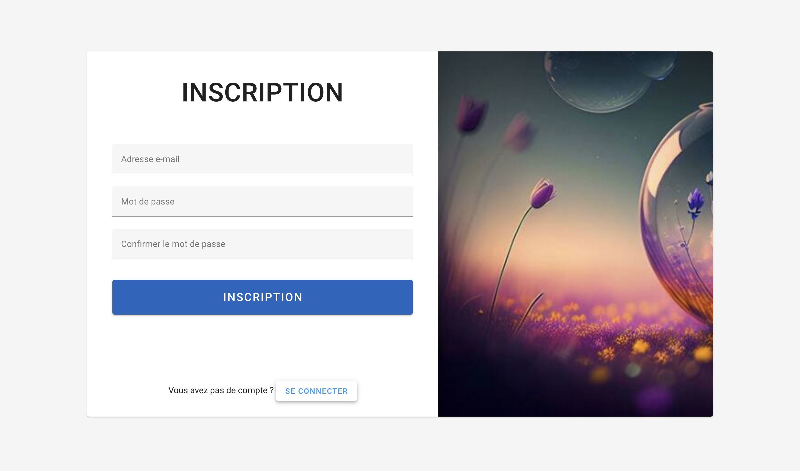

# Documentation Utilisateur

## I. Inscription/Connexion

Pour vous inscrire, vous devez utiliser une adresse email ainsi qu’un mot de passe contenant à minima 8 caractères, dont des minuscules, des majuscules et des chiffres.

L’adresse email ne doit pas déjà être utilisée par un utilisateur.

---

## II. Tableau de Bord

Une fois connecté, vous aurez accès au tableau de bord où vous pourrez analyser vos dépenses.

- **Grille d'Informations :** Contient des informations intéressantes comme le total dépensé et la dépense moyenne des transactions pour la période sélectionnée.
- **Courbe des Dépenses :** Affiche la courbe des dépenses pour la période choisie.
- **Sélecteur de Période :** Permet de choisir la période à afficher.
- **Liste des Dépenses :** Affiche les dépenses de la période donnée.
- **Répartition par Catégorie :** Montre la répartition des dépenses par catégorie pour la période donnée. (Posez le curseur dessus pour avoir le détail de la somme.)

---

## III. Transactions

- **Barre de Recherche :** Permet de rechercher les transactions par description.
- **Filtres par Catégories :** Liste des filtres par catégories présentes actuellement (choix multiples).
- **Ajouter une Transaction :** Bouton pour ajouter une nouvelle transaction.
- **Exporter en CSV :** Bouton pour exporter le tableau en fichier CSV.
- **Sélecteur Multiple :** Permet de supprimer les transactions en groupe.
- **Boutons d’Actions :** Boutons pour éditer ou supprimer les transactions.

---

## IV. Catégories

- **Créer une Nouvelle Catégorie :** Bouton pour créer une nouvelle catégorie.
- **Nom de la Catégorie :** Nom de la catégorie.
- **Actions de la Catégorie :** Éditer ou supprimer une catégorie.
- **Informations sur la Catégorie :** Montant dépensé durant la période sélectionnée et limite mensuelle définie.

---

## V. Notifications et Paramètres

En haut à droite du site, vous trouverez trois éléments :

1. **Cloche des Notifications :** Permet de voir et de supprimer vos notifications. Les notifications sont générées suite au dépassement d’une limite mensuelle, à une création réussie ou ratée, ainsi qu’à une suppression ou une édition.
2. **Paramètres :** Permet de passer en thème sombre/clair et de choisir votre devise.
3. **Avatar Utilisateur :** Représenté par un rond bleu contenant les deux premiers caractères de l’adresse email, permettant de se déconnecter.
